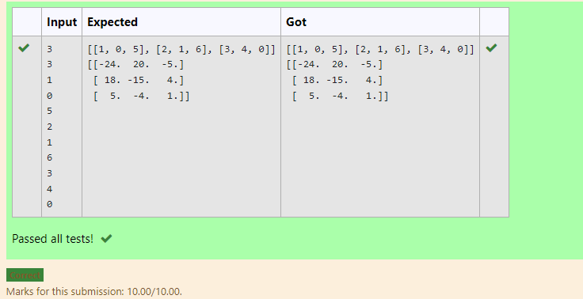

# Inverse-of-matrix

## AIM:To find Inverse-of-matrix

## ALGORITHM:
### Step 1:import numpy as np
### Step 2:create an empty lists
### Step 3:get inputs from the user
### Step 4:use inverse function
### Step 5:run the program

## PROGRAM:
~~~
import numpy as np
l1,l2=[],[]
r=int(input())
c=int(input())
for i in range (r):
    for j in range (c):
        num=int(input())
        l1.append(num)
    l2.append(l1)
    l1=[]
print(l2)
value1=np.array(l2)
inverse=np.linalg.inv(value1)
print(inverse)
~~~
## OUTPUT:

## RESULT:
inverse of matrix is successfully completed